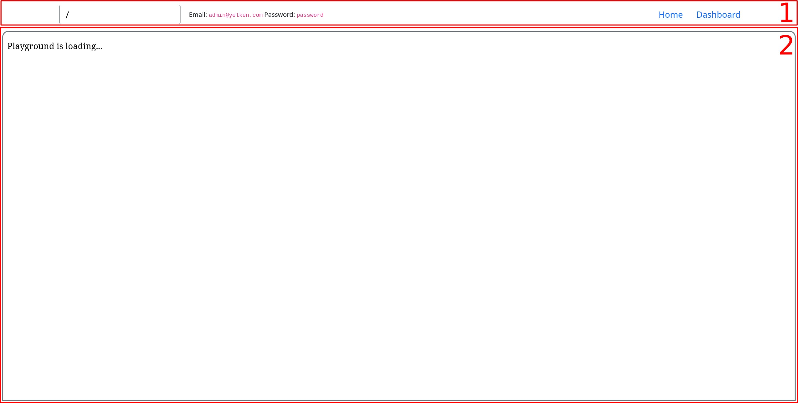

# Playground

Yelken has a playground where you can entirely run it in the browser.
You can access it from [https://yelken-cms.netlify.app](https://yelken-cms.netlify.app) and start playing with Yelken.

Running Yelken entirely inside the browser is achieved by compiling it to WebAssembly.
In the meantime, required migration files, App's assets, and a basic theme are embedded into WebAssembly binary.
For the database, Yelken uses SQLite instead of PostgreSQL while running in the browser.

When the playground website is loaded by the browser, a [Service Worker](https://developer.mozilla.org/en-US/docs/Web/API/Service_Worker_API) is registered.
Within the Service Worker context, the WebAssembly binary is instantiated, and all the requests sent by the browser to any of Yelken's endpoints are directed to this running instance.

When you open the playground, there are two part that are highlighted in the image below.
The first one is the controller part where you can see the current URL of the playground, credentials of admin user and a few useful button to navigate to Yelken's home page and App's dashboard.
Second one is the frame where Yelken will be rendered.

When you open the playground for the first time, a **Playground is loading** message will be displayed while necessary assets are being downloaded in the background.
Once all the assets are downloaded, you can start interacting with Yelken.
